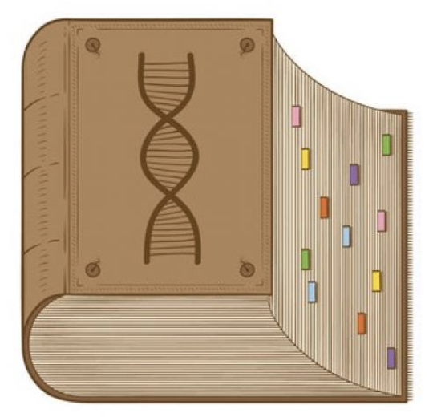

# Un poco sobre mí

```{r,echo=FALSE,out.width='88%',fig.align='center'}

```

---

# ¿Qué es la Bioinformática?

[
```{r,echo=FALSE,out.width='70%',fig.align='center'}

```
](http://fisiolofar.blogspot.com/2013/09/el-fascinante-mundo-de-la-bioinformatica.html)

---
class: chapter-slide

# ¿Para qué nos sirve la Bioinformática?

---
# Conocer las secuencias de los genes
<br>

.pull-left[
.pull-left[
```{r,echo=FALSE,out.width='100%'}

```

```{r,echo=FALSE,out.width='100%'}

```
]
.pull-right[
```{r,echo=FALSE,out.width='100%'}

```

```{r,echo=FALSE,out.width='100%'}

```
]
]

--

.pull-right[<br>
```{r,echo=FALSE,out.width='60%',fig.align='center'}

```
]

---
# Armar el rompecabezas de nuevos genomas
<br>

.pull-left[
.pull-left[<br>
```{r,echo=FALSE,out.width='100%'}

```

```{r,echo=FALSE,out.width='100%'}

```
]

.pull-right[
```{r,echo=FALSE,out.width='100%'}

```

```{r,echo=FALSE,out.width='80%',fig.align='center'}

```
]
]

--

.pull-right[
```{r,echo=FALSE,out.width='100%'}

```

.pull-left[
```{r,echo=FALSE,out.width='100%'}

```
]
.pull-right[
```{r,echo=FALSE,out.width='100%'}

```
]
]

---
# Generar bases de datos
<br>

.pull-left[
```{r,echo=FALSE,out.width='100%'}

```
]

--
.pull-right[
```{r,echo=FALSE,out.width='110%'}

```
]

---
# Estudiar la regulación de los genes
<br>

.pull-left[
```{r,echo=FALSE,out.width='100%'}

```
]

--

.pull-right[<br><br>
```{r,echo=FALSE,out.width='100%'}

```
]

---
# Estudiar la regulación de los genes
<br>

.pull-left[
```{r,echo=FALSE,out.width='100%'}

```
]

--

.pull-right[
[
```{r,echo=FALSE,out.width='110%'}

```
](https://www.youtube.com/watch?v=h_1QLdtF8d0)
]

---
# Conocer cuánto se encienden o apagan los genes 

.pull-left[
```{r,echo=FALSE,out.width='50%',fig.align='center'}

```
]

--

.pull-right[
```{r,echo=FALSE,out.width='78%',fig.align='center'}

```
]

---
# Reconstruir la evolución de las especies

.pull-left[
```{r,echo=FALSE,out.width='75%',fig.align='center'}
knitr::include_graphics("img/tree.jpg")
```
]

.pull-right[<br><br><br<br><br><br>
```{r,echo=FALSE,out.width='100%'}

```
]

---
# Estudiar la estructura de las proteínas

.pull-left[
```{r,echo=FALSE, out.width='100%',fig.align='center'}

```

```{r,echo=FALSE, out.width='80%',fig.align='center'}

```
]

.pull-right[
```{r,echo=FALSE, out.width='70%',fig.align='center'}

```
]

---
class: chapter-slide
# ¿Cuáles son las herramientas que utilizamos? 

---
# Existe una gran diversidad de lenguajes de programación

```{r,echo=FALSE, out.width='70%',fig.align='center'}
knitr::include_graphics("img/languages.png")
```

En R existen > 2000 programas enfocados a análisis biológicos.

---
# Las herramientas bioinformáticas están en constante desarrollo

```{r,echo=FALSE, out.width='100%',fig.align='center'}

```
.center[ <https://www.ncbi.nlm.nih.gov/pmc/articles/PMC7575047/> ]


